# Интерфейс учителя · Фаза 1

Описание интерфейса для технической команды. Формат каждого экрана:

1. **User stories** — что делает пользователь и зачем (у экрана может быть несколько; нумерация TS-N — сквозная по документу).
2. **Контент и действия** — что на странице и что можно сделать (дефолт для реализации); AC = критерии приёмки.
3. **Референс** — скрин из прототипа в режиме «Фаза 1» (опционально).

**Скоуп — только Фаза 1.** Функции последующих фаз (карта навыков, misconception-разбор по фото, разбор ДЗ, AI-коуч, диагностика, дифференциация ДЗ по трекам, рекомендация трека ИИ) в этот документ не входят.

**Сквозной контекст демо:** учитель Нармин, класс **4-А, школа №297**, ближайший урок «Уравнения · неизвестное слагаемое (x + 5 = 12)», стандарт E1. Данные — мок. Устройство — ноутбук/десктоп (широкий дашборд). Язык — RU/AZ (переключатель в шапке).

**Прототип:** [`index.html`](index.html) → в шапке переключатель этапа поставить **«Фаза 1»**. Скрины Фазы 1 — в [`_screens_p1/`](_screens_p1/).

**Где Фаза 1 проще полного продукта (важно для оценки):**
- На уроке нет AI-аналитики в реальном времени — учитель видит **факты** (кто что ответил, кто застрял), без ИИ-формулировок и алертов.
- Презентация объяснения идёт **в отдельном окне на проекторе** (вне продукта); внутри продукта — только фронтальные задания и управление планшетами.
- Домашнее задание — **единый стандартный набор на весь класс** (без деления по уровням).
- Аналитика урока — **два разреза на одном экране** (по заданиям и по детям с треками), без карты мастерства по критериям-классам, группировок ошибок и формативной ОС.
- Когорта A/B/C в «Моём классе» — **проставляется вручную учителем** (ИИ-рекомендации нет).

**Решения встречи (2026-06-30) — учтены в этой версии:**
- **Паспорт урока:** показываем тему/цель/критерии; пререквизиты — **не must-have** (в Ф1 скрыты). От раздатки уходим, но любой демонстрируемый артефакт можно **приложить ссылкой** (раздел «Материалы урока» в методуказаниях).
- **Разминка/фронтальные:** дети получают задание **на планшет независимо**, учитель **не шарит экран** (только выдаёт → открывает разбор → видит распределение). Имена в «не справились» — **кликабельны** (провал в ученика).
- **Объяснение:** фронтальное задание разворачивается в **отдельную вкладку/окно** (не pop-up) — для проектора.
- **Практика:** сигнал «поднял руку» привязан **к ученику** (не к заданию; без лимита вызовов); у учителя — **очередь ожидания**, в трекере **«!»** на задании, где позвал; **алерт закрывает учитель**. Ученик видит **свою позицию в очереди**, может **решать дальше** — отложенное помечается красным **«✗»** и возвращается.
- **Рефлексия:** эмодзи-шкала, фронтальная выдача как в разминке, **без показа правильного ответа**.
- **Домашка:** дедлайн — **только дата**, дефолт **«до 12:00»** (время не редактируем). Привязки «к какому уроку» нет — для математики важна регулярность.
- **Завершение:** решаемость **+ разбивка по критериям** — уже в Ф1.
- **📸 Проверка фото-работ:** детальный экран проверки (очередь, **категории уверенности ИИ ~95%/~60%/не уверен** по критериям MetaTist, действия учителя, статус ученику «проверено/верно/неверно») — **Фаза 2**. В Ф1 фото просто уходит учителю (без статуса ученику), как и было.

---

## 0. Типы уроков (D1)

**User stories.**
- TS-1. Как учитель, я хочу запускать уроки **разных видов** (новое знание / МСО / буферный), чтобы интерфейс вёл меня по правильной структуре фаз и мониторингу для каждого типа.
- TS-2. Как учитель, я хочу запускать урок **быстрым лаунчером** на «Подготовке к уроку» (без привязки к плану), чтобы начать любой тип урока сразу.
- TS-3. Как учитель, в live-режиме я хочу видеть **индикатор текущего типа/подтипа** со ссылкой «сменить», чтобы понимать, в каком сценарии я сейчас, и при ошибке вернуться к выбору.
- TS-4. Как учитель **на уроке МСО**, я хочу видеть **только «кто на каком задании»** (правильность/содержание/баллы скрыты в реальном времени), чтобы обеспечить честность контрольной; проверка и баллы — **после** теста.
- TS-5. Как учитель **на уроке МСО**, я хочу получать **push-уведомления** (не приступил 3 мин · долго на задании · потеря связи · вышел из окна · завершил), чтобы вовремя реагировать.
- TS-6. Как учитель **на буферном уроке**, я хочу видеть мониторинг 🟢🟡🔴 (2 / 3+ ошибок подряд) и **рекомендацию фронтального разбора** при массовых ошибках, чтобы вовремя собрать класс.

Источник логики — док [«Логика генерации уроков»](https://docs.google.com/document/d/1uF1JXL5O4m1VfQ3jZeCxDsx9r6HPE-DLJlUnP__v3zc/edit). **Решения 2026-06-29:** запуск — **быстрый лаунчер** (без привязки к плану); объём — **каркас всех трёх типов** (новые экраны фаз — заглушки с ключевой механикой, детализируем по одному).

**Три типа (с подтипами):**
- **Урок нового знания** — *Объяснение / Практика*. Фазы: Актуализация → Разбор новой темы → Практика на планшетах (треки А/Б/В) → Рефлексия. ≈ текущий прототип (в прототипе фаза 1 пока названа «Разминка» — свести с «Актуализацией» позже).
- **Урок МСО** — *Диагностика / Контрольная*. Фазы: Актуализация → МСО (16 заданий, 35 мин) → Рефлексия. Мониторинг — см. TS-4/TS-5.
- **Буферный урок** — *Обобщающие задания / Работа над ошибками*. Фазы: Актуализация → Индивидуальная работа (треки) → Рефлексия («Найди ошибку»). «Работа над ошибками» — после МСО: задания-аналоги ошибок (другие числа), у ученика кнопка «Вспомнить, как решать».

**Контент и действия.**
- На «Подготовке к уроку» — **лаунчер типов**: карточки трёх типов с кнопками подтипов; клик запускает урок выбранного типа (TS-1, TS-2).
- В live-режиме сверху — **индикатор текущего типа/подтипа** со ссылкой «сменить» (назад в лаунчер) (TS-3).
- Трекер фаз и тело каждой фазы подстраиваются под тип.

*Каркас. Не сделано (детализация дальше): экран пост-проверки МСО (ответы/критерии/баллы), реальные пороги треков и score, ученическая часть типов (см. BACKLOG · D6).*

**Референс.**
- Лаунчер типов (TS-1, TS-2): 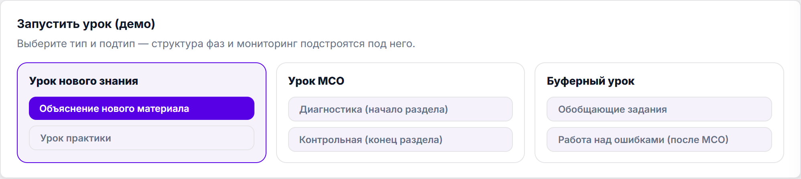
- Мониторинг МСО (TS-4, TS-5): 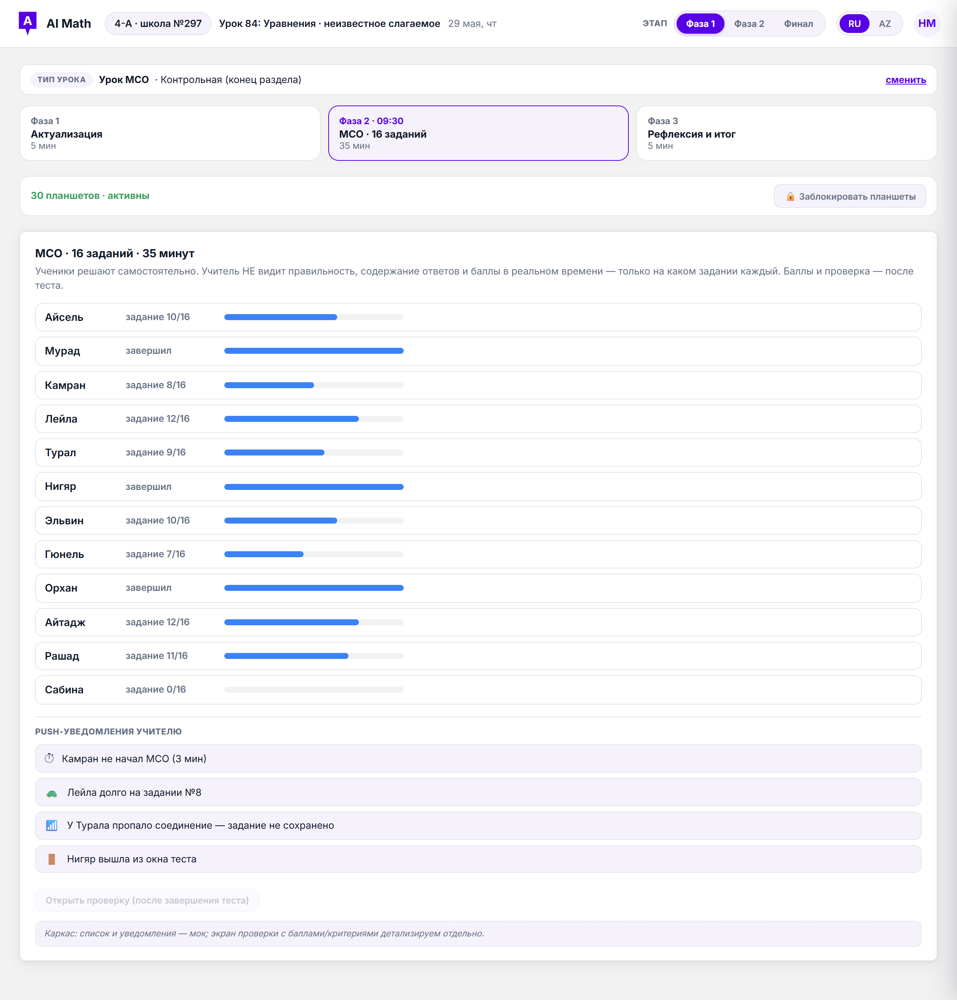
- Буферный урок · мониторинг треков 🟢🟡🔴 (TS-6): 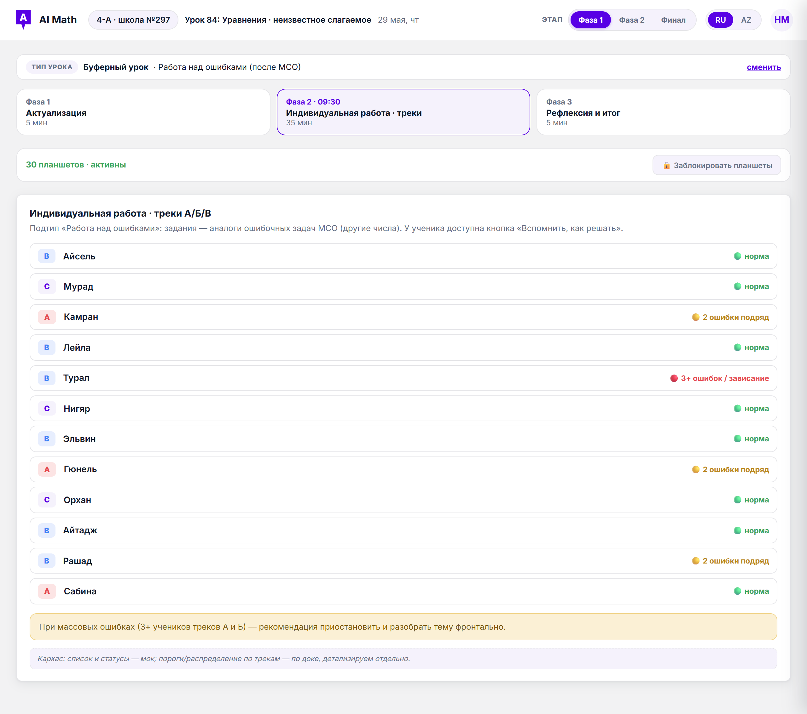

*На live-скринах сверху виден **индикатор типа урока** со ссылкой «сменить» (TS-3).*

---

## 1. Главная

**User stories.**
- TS-7. Как учитель, утром я хочу **одним взглядом понять, какой урок сегодня**, чтобы не тратить время занятия на поиск материалов.
- TS-8. Как учитель, я хочу видеть **класс/школу** и «картину класса на сегодня», чтобы убедиться, что вошёл в нужный класс.
- TS-9. Как учитель, я хочу из карточки урока **быстро перейти к подготовке** (а не сразу в live-урок), чтобы спокойно подготовиться заранее.
- TS-10. Как учитель, я хочу видеть **навигацию по разделам** (Главная · Урок · Аналитика · Тематический план · Мой класс), чтобы попасть в любой инструмент.

**Контент и действия.**
- Приветствие + класс/школа («картина класса на сегодня») (TS-8).
- Карточка ближайшего урока (TS-7): № урока, раздел, тема, стандарт + число критериев освоения.
- Кнопка **«Подготовка к уроку →»** — ведёт на экран подготовки, **не** сразу в live-урок (TS-9).
- Левое меню навигации: Главная · Урок (live) · Аналитика · Тематический план · Мой класс (TS-10).

*В Фазе 1 на главной нет трёх KPI-показателей (прогресс по программе / средняя решаемость / выполнение ДЗ) — они появятся позже.*

**Референс.** 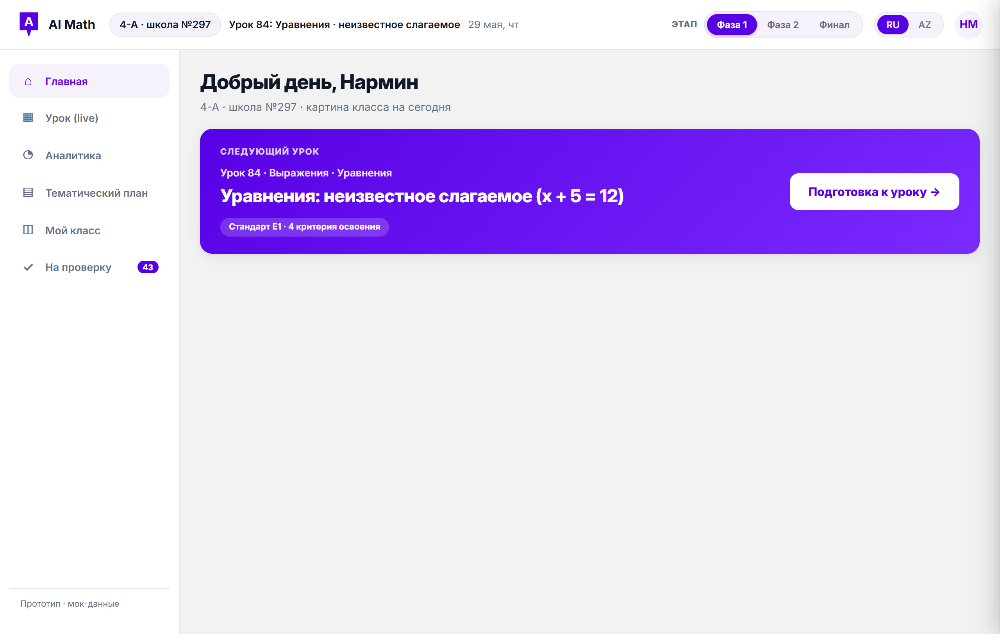

---

## 2. Подготовка к уроку

**User stories.**
- TS-11. Как учитель, перед уроком я хочу заранее увидеть **структуру урока и готовые материалы**, чтобы войти в класс уверенно и без подготовки за свой счёт.
- TS-12. Как учитель, я хочу видеть **паспорт урока** (тема, цель, критерии освоения, навыки), чтобы понимать, к какому результату веду класс.
- TS-13. Как учитель, я хочу открыть **методические указания** (тайминг фаз, рекомендации, типичные ошибки темы), чтобы провести урок по методике.
- TS-14. Как учитель, я хочу **просмотреть содержимое каждой из 4 фаз** заранее, чтобы знать, что покажу детям.
- TS-15. Как учитель, я хочу **начать урок** прямо отсюда, чтобы перейти в live-режим, когда класс готов.
- TS-49. Как учитель, я хочу видеть **«Материалы урока — ссылки»** (любой демонстрируемый артефакт: презентация, карточки, видео, рабочий лист, эталон проверки), чтобы быстро открыть нужное — без бумажной раздатки.

**Контент и действия.**
- Карточка урока (тема, № урока, дата, стандарт) + кнопка **«Начать урок →»** (TS-15).
- **Паспорт урока:** цель, стандарт, критерии освоения (К1–К4), развиваемые навыки (TS-12).
  - AC: **пререквизиты** — не must-have, в Ф1 **скрыты** (появятся позже).
- Кнопка **«Методические указания к уроку»** — открывает модалку: тайминг 4 фаз, рекомендации по фазам, типичные ошибки темы и **раздел «Материалы урока — ссылки»** (TS-13, TS-49).
  - AC: материалы — это **ссылки** на артефакты; от бумажной раздатки уходим, но возможность приложить материал ссылкой остаётся.
- **Материалы для подготовки** — 4 фазы (Разминка / Объяснение / Практика / Рефлексия), у каждой число заданий/слайдов и время; кнопка **«Просмотреть»** раскрывает содержимое. Только просмотр (TS-14, TS-11).

**Референс.** Подготовка: 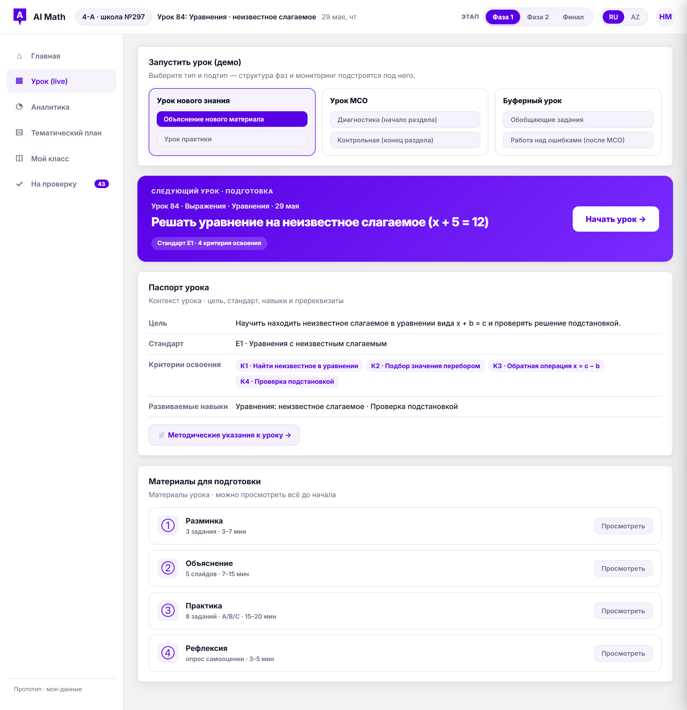 · материалы-ссылки в методуказаниях: 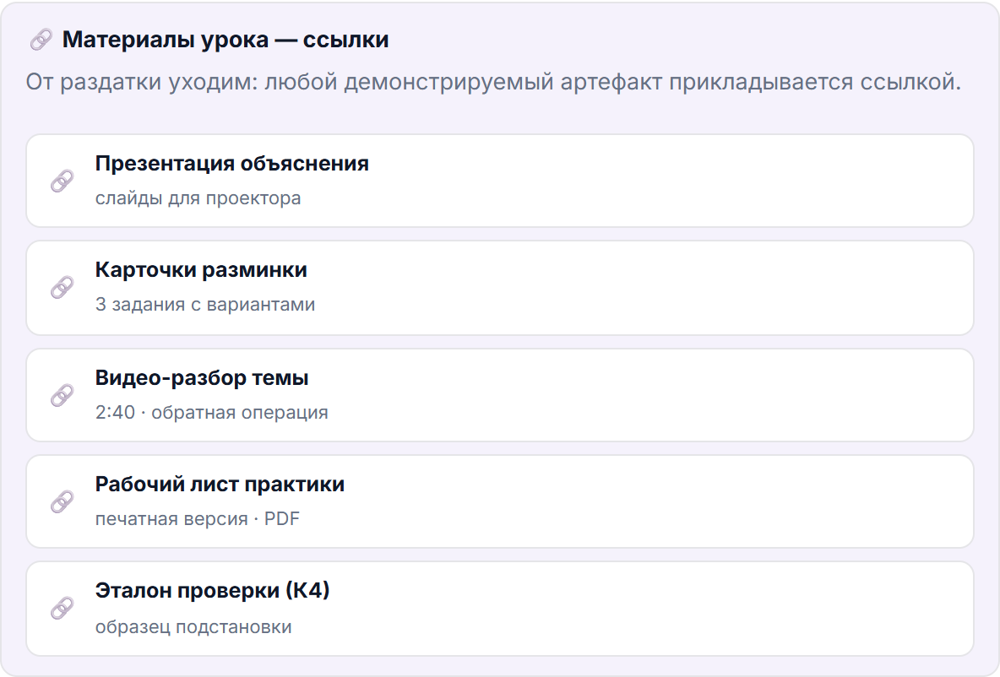

---

## 3. Урок (live) · Фаза 1 урока — Разминка

> Экраны 3–6 — это live-режим урока. Сверху всегда: **трекер 4 фаз урока** (с таймером текущей) и **контрол-бар планшетов**. На время активного урока боковое меню скрывается (present-mode).

**User stories.**
- TS-16. Как учитель, на любой фазе урока я хочу **блокировать/разблокировать планшеты** одной кнопкой, чтобы стартовать или остановить работу класса (*контрол-бар планшетов, сквозной для экранов 3–6*).
- TS-17. Как учитель, пока класс решает разминку, я хочу видеть, **сколько детей уже ответили**, чтобы понять, можно ли показывать разбор и двигаться дальше.
- TS-18. Как учитель, я хочу **переключать задания разминки** (№1 / №2 / №3), чтобы вести класс по порядку.
- TS-19. Как учитель, я хочу **показать ответы** (распределение по вариантам с долей верных и подсветкой правильного), чтобы перейти к разбору — автоматически по готовности всех или по кнопке.
- TS-20. Как учитель, после раскрытия ответов я хочу видеть **поимённый список «не справились»** (кто ответил неверно) — **только у себя**, и **провалиться по имени** в карточку ученика, чтобы помочь точечно (D4).
- TS-21. Как учитель, я хочу **развернуть задание в отдельную вкладку/окно** для проектора, чтобы показать его классу без поимённой статистики (D3).

**Контент и действия.**
- **Контрол-бар планшетов** (TS-16): статус «30 планшетов · активны / заблокированы» + кнопка **«Заблокировать / Разблокировать планшеты»**.
- Заголовок разминки, переключатель заданий **№1 / №2 / №3** (TS-18), текст текущего задания.
- Состояние сбора ответов: **«26/30 ответили · ждём остальных»** (TS-17).
  - AC: задание приходит детям **на планшет независимо** (каждый видит у себя); учитель **не транслирует свой экран** — он только выдаёт задание, открывает разбор и видит распределение.
- Кнопка **«Показать ответы»** (TS-19) — раскрывает распределение ответов по вариантам (с долей верных и подсветкой правильного). Распределение появляется автоматически, когда ответили все, **или** по этой кнопке (чтобы остановить решение у детей и перейти к разбору).
- После раскрытия — **поимённый список «не справились»** (TS-20). Виден **только учителю**; на экранах учеников не показывается. **Имена кликабельны** — открывают карточку ученика. *(D4)*
- Кнопка **«Развернуть на весь экран»** у задания (TS-21) — открывает его в **отдельной вкладке/окне** (перетащить на проектор). В развёрнутом виде — только задание и распределение по вариантам, **без поимённой статистики**. *(D3)*

**Референс.** 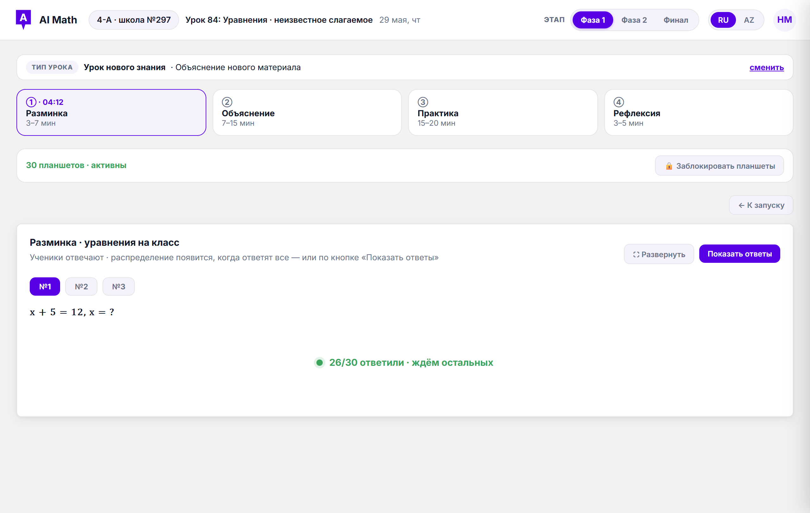

---

## 4. Урок (live) · Фаза 2 урока — Объяснение

**User stories.**
- TS-22. Как учитель, объясняя тему, я хочу показывать **слайды в отдельном окне на проекторе**, чтобы удерживать внимание класса, а не на планшетах.
- TS-23. Как учитель, по ходу объяснения я хочу давать **короткие фронтальные задания** (открывать по одному), чтобы проверять понимание сразу.
- TS-24. Как учитель, по фронтальному заданию я хочу видеть **распределение ответов и поимённый список «не справились»** (как в разминке), чтобы решить, идти дальше или дообъяснить (D4).
- TS-25. Как учитель, я хочу **развернуть фронтальное задание в отдельную вкладку/окно** для проектора (без поимённой статистики) (D3).
- TS-16 (повтор). Контрол-бар планшетов — блокировка/разблокировка.

**Контент и действия.**
- Плашка **«Презентация — в отдельном окне»**: слайды объяснения учитель показывает в отдельном окне на проекторе, вне продукта (TS-22).
- **Фронтальные задания · объяснение** (TS-23, TS-24): задания этапа открываются по одному кнопкой **«Открыть для решения»** → задание появляется на планшетах → сбор ответов → распределение (как в разминке), включая **поимённый список «не справились»** *(D4)*.
- У каждого фронтального задания — кнопка **«Развернуть на весь экран»** (TS-25): открывает задание в **отдельной вкладке/окне** (не pop-up), чтобы перетащить на проектор/второй экран; в развёрнутом виде — без поимённой статистики *(D3)*.
- Контрол-бар планшетов (блокировка) (TS-16).

**Референс.** Объяснение: 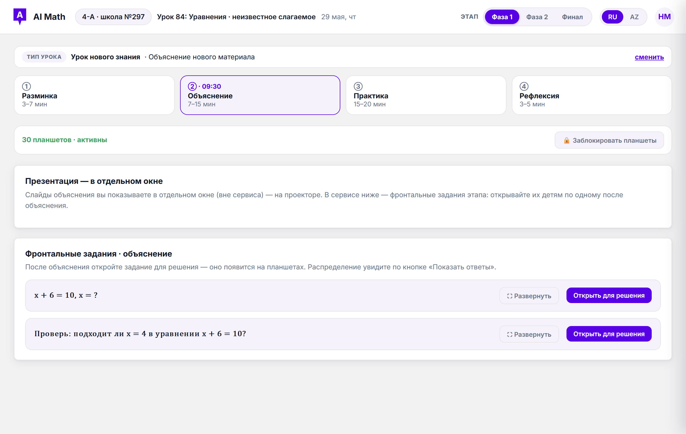 · задание в отдельном окне (проектор): 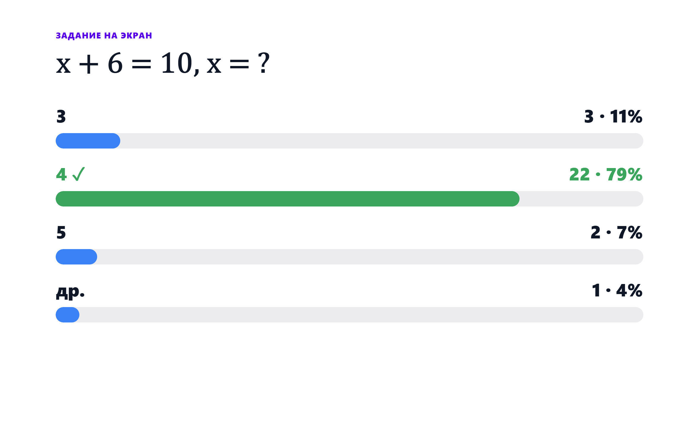

---

## 5. Урок (live) · Фаза 3 урока — Практика

**User stories.**
- TS-26. Как учитель, пока класс работает над задачами, я хочу видеть **сводные счётчики** (кто в теме / опередил / застрял / с типовой ошибкой), чтобы оценить класс целиком.
- TS-27. Как учитель, я хочу видеть **live-карту класса** — по каждому ученику последовательность заданий со статусом каждой попытки, чтобы понять, на каком задании кто стоит и кому помочь.
- TS-28. Как учитель, я хочу видеть у каждого ученика **пометку трека A/B/C** (которую я проставил вручную), чтобы понимать, кому какие задания идут.
- TS-29. Как учитель, я хочу получать сигнал **«поднял руку»** от ученика, чтобы подойти к нему точечно.
- TS-50. Как учитель, я хочу видеть **очередь поднявших руку** (по времени ожидания, с треком и **на каком задании** позвал) и **закрывать сигнал сам** кнопкой «Подошёл», чтобы вести помощь по порядку, а не по случайным кликам.
- TS-51. Как учитель, в трекере заданий я хочу видеть **«!» на том задании**, где ученик позвал, чтобы сразу понимать контекст вызова.
- TS-55. Как учитель, во время урока я хочу видеть, что ученик **отправил фото-работу** по письменному заданию, чтобы знать, что она сдана (а не потеряна).

**Контент и действия.**
- Сводные счётчики по классу: сколько **в теме / опередили / застряли / с типовой ошибкой** (TS-26).
- **Live-карта класса** (TS-27): по каждому ученику — последовательность заданий с цветным статусом каждой попытки (решено с 1-й попытки / решено с попыток / ошибается / решает сейчас / не дошёл). Видно, на каком задании кто стоит.
- У каждого ученика — пометка трека A/B/C (учитель распределил вручную, см. экран 11) (TS-28).
- **Сигнал «поднял руку»** (TS-29, TS-50, TS-51):
  - AC: сигнал привязан **к ученику, а не к заданию** — повторные нажатия не плодят записей (20 кликов = 1 подход); **лимита вызовов нет**.
  - AC: справа — **очередь «Подняли руку»**: позиция, имя+трек, **задание ЗN**, время ожидания; строка кликабельна (провал в ученика).
  - AC: **закрывает сигнал учитель** кнопкой **«✓ Подошёл»** (не ученик — чтобы случайный тап на планшете не снимал вызов).
  - AC: в трекере на ячейке нужного задания — маркер **«!»** (снимается, когда учитель подошёл).
- **Фото-задание в трекере** (TS-55): у задания, которое решается в тетради, в шапке столбца — иконка **📷**; когда ученик отправил фото, его ячейка становится **жёлтой «отправлено» (📷)**. Верно/неверно не показывается — **проверку учитель делает позже** (авто-проверки фото в Ф1 нет).
- *(Ученическая часть, экран ученика 5):* ученик видит **свою позицию в очереди**, может **«Решать дальше»** пока ждёт; отложенное задание помечается красным **«✗»** и к нему можно вернуться.

**Референс.** 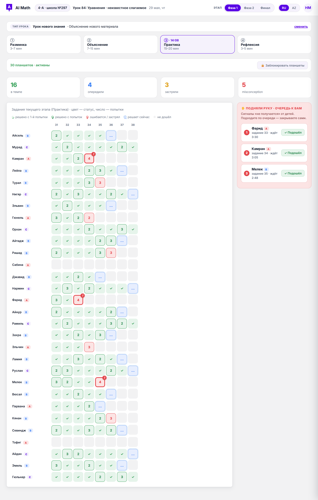

---

## 6. Урок (live) · Фаза 4 урока — Рефлексия

**User stories.**
- TS-30. Как учитель, в конце урока я хочу видеть, **сколько детей сдали самооценку**, чтобы понять, дождаться ли остальных.
- TS-31. Как учитель, я хочу видеть **распределение оценок урока по эмодзи-шкале**, чтобы понимать эмоциональный отклик класса.
- TS-32. Как учитель, я хочу **перейти к выдаче домашнего задания** прямо отсюда, чтобы закрыть урок одним потоком.

**Контент и действия.**
- Счётчик: **«Самооценку сдали 27 из 30»** (TS-30).
- Вопрос «Понравился ли тебе урок?» + распределение по эмодзи-шкале (Интересно / Нормально / Скучно) с числом ответов (TS-31).
- Кнопка **«К выдаче домашнего задания →»** (TS-32).
  - AC: рефлексия выдаётся **фронтально, как разминка** (запускает учитель, дети отвечают на планшетах), но **без показа «правильного ответа»** — это эмоциональная оценка, верных/неверных нет.

*В Фазе 1 нет блока «самооценка vs реальная решаемость» — только эмоциональная оценка урока.*

**Референс.** 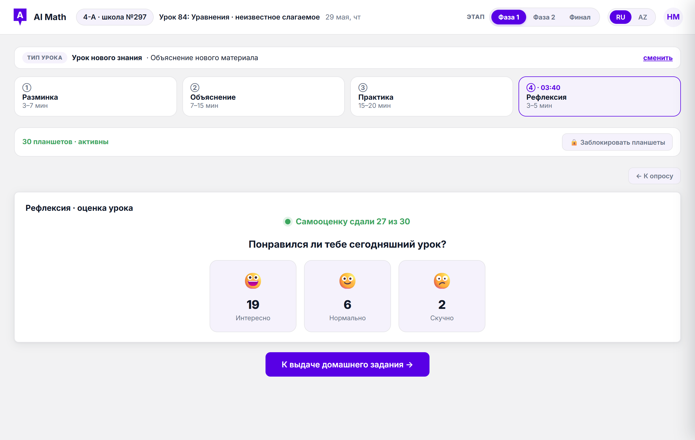

---

## 7. Урок (live) · Выдача домашнего задания

**User stories.**
- TS-33. Как учитель, в конце урока я хочу **выдать классу домашнее задание одним нажатием**, чтобы не готовить и не раздавать его вручную.
- TS-34. Как учитель, я хочу **задать срок сдачи** ДЗ (только **дата**), чтобы дети понимали дедлайн.
- TS-35. Как учитель, я хочу **посмотреть превью заданий** набора перед выдачей, чтобы знать, что отправляю.
- TS-36. Как учитель, после выдачи я хочу **подтверждение и переход к завершению урока**, чтобы убедиться, что ДЗ ушло в профили.

**Контент и действия.**
- Заголовок **«Домашнее задание · стандартный набор»** — единый набор для всего класса (TS-33).
- **Срок сдачи** — редактируемое поле **даты**; время **не редактируется**, по умолчанию **«до 12:00»** указанного дня (прописано в плашке) (TS-34).
  - AC: привязки «к какому уроку» **нет** — для математики не подходит, ориентир — дата (важна регулярность).
- Список заданий набора (превью) (TS-35).
- Кнопка **«Выдать ДЗ в профили учеников →»** (TS-33).
- После выдачи — **экран подтверждения** («Домашнее задание отправлено», что произойдёт дальше: уведомление в профиль, срок сдачи, результаты появятся по мере сдачи) + кнопка **«Завершить урок →»** (TS-36).

*В Фазе 1 набор не делится на уровни A/B/C — он одинаковый для всех. Ученики решают задания в своём профиле, результат сохраняется.*

**Референс.** 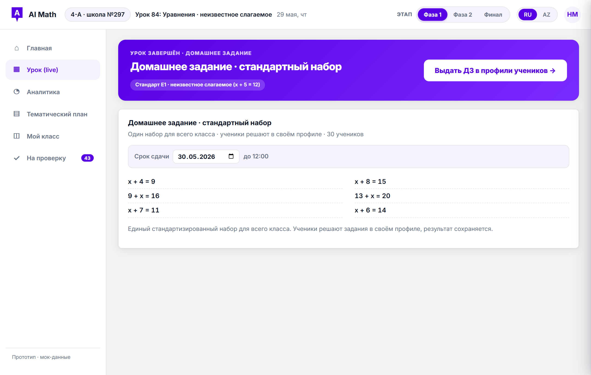

---

## 8. Урок (live) · Урок завершён

**User stories.**
- TS-37. Как учитель, сразу после урока я хочу увидеть **решаемость урока** (общую долю верных), чтобы зафиксировать, как прошло занятие.
- TS-38. Как учитель, я хочу увидеть **строку-вывод по уроку** (что класс усвоил уверенно, что просело по критериям), чтобы понять, что повторить.
- TS-52. Как учитель, я хочу увидеть **разбивку решаемости по критериям освоения** (К1–К4), а не только общую цифру, чтобы понять, какой критерий просел.

**Контент и действия.**
- Блок «Итог урока»: **решаемость урока** (общая доля верных) (TS-37).
- Одна строка-вывод по уроку (что класс усвоил уверенно, что просело — по критериям) (TS-38).
- **Решаемость по критериям освоения** (TS-52): по каждому критерию (К1–К4) — % с цветовой маркировкой. *(Разбивка по критериям — уже в Ф1; правила агрегации обкатываются отдельно.)*

*В Фазе 1 здесь нет показателей «мастерство класса» / «учеников к вниманию» и нет кнопки перехода в полный разбор — итог короткий.*

**Референс.** 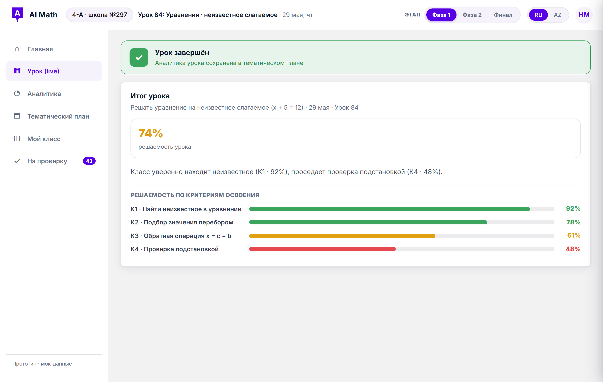

---

## 9. Аналитика · Свод урока (два разреза)

**User stories.**
- TS-39. Как учитель, после урока я хочу увидеть **разрез по заданиям** (средняя решаемость каждого), чтобы провальные задания были видны сразу.
- TS-53. Как учитель, я хочу увидеть **разрез по детям** (дети слева, задания справа, успешность: решено / частично / не начато) **с пометкой трека**, чтобы понять, кто где просел.

**Контент и действия.**
- Заголовок **«Свод урока · два разреза»** — оба разреза на **одном экране**.
- **По заданиям** (TS-39): по каждому заданию — **доля верных ответов** (с цветовой маркировкой), данные из live-урока.
- **По детям** (TS-53): матрица «ученик × задание» со статус-ячейками **решено / частично / не начато**; у каждого ученика — **трек A/B/C**; клик по ученику → карточка.

*В Фазе 1 аналитика — это свод из двух разрезов (по заданиям и по детям). Карта мастерства по критериям-классам, группировки ошибок, формативная ОС и список уроков с трендами — следующие фазы.*

**Референс.** 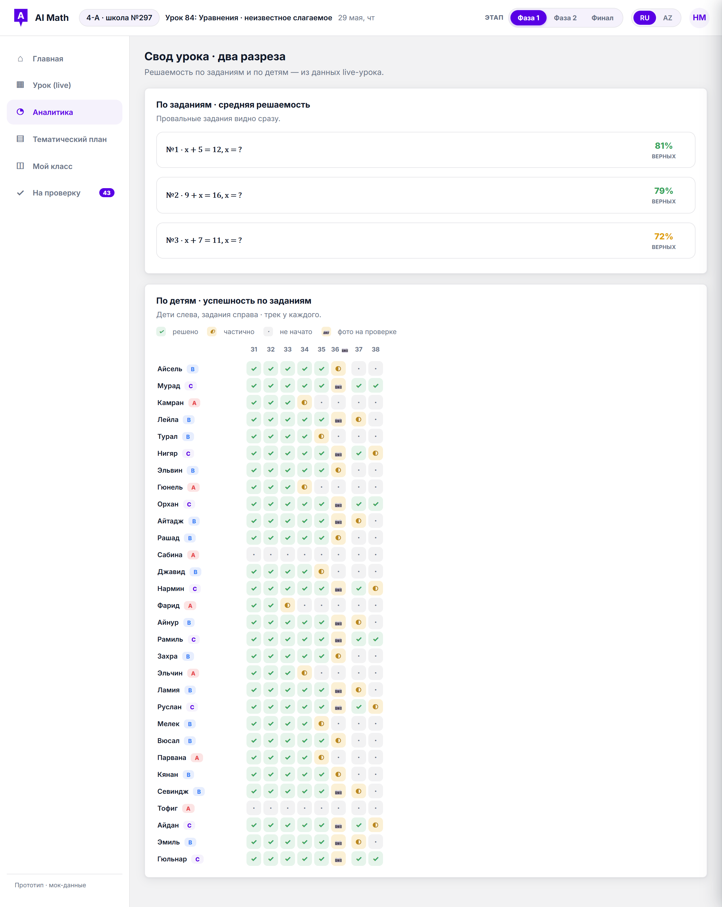

---

## 10. Тематический план

**User stories.**
- TS-40. Как учитель, я хочу видеть **программу со статусом уроков и решаемостью пройденного**, чтобы понимать, идти дальше или вернуться.
- TS-41. Как учитель, я хочу **редактировать даты уроков**, чтобы план соответствовал реальному расписанию.
- TS-42. Как учитель, я хочу из плана **перейти в свод пройденного урока**, чтобы посмотреть детали.

**Контент и действия.**
- Список уроков курса, по строке: **дата** (изменяемая) · **тема** · **модуль** · **статус** (пройден / текущий / впереди) · **решаемость** по пройденным (TS-40).
  - AC: **модуль** (раздел программы) выведен отдельной колонкой-чипом.
- Даты уроков **редактируемые** (клик по дате → календарь; последующие уроки сдвигаются на следующие будни) (TS-41).
- Клик по строке → **провалиться в свод пройденного урока** (TS-42).

**Референс.** 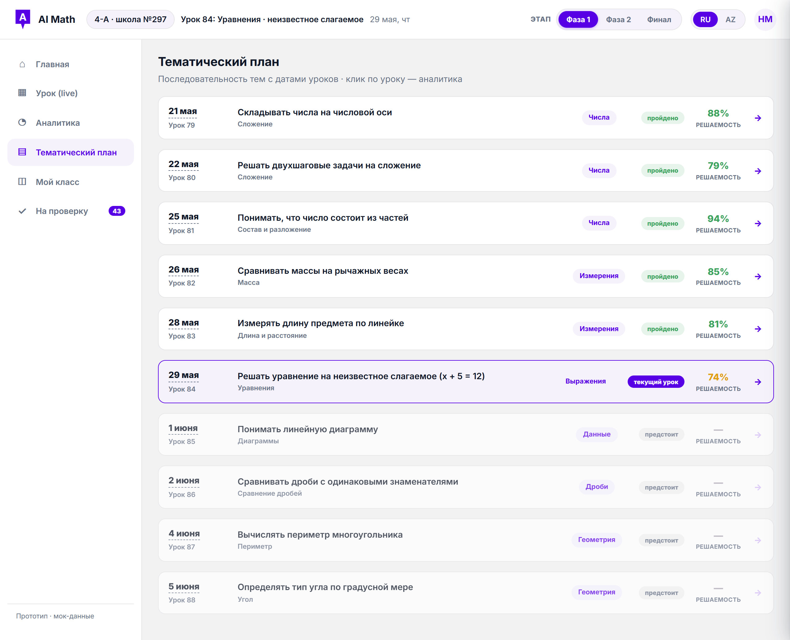

---

## 11. Мой класс · Ученики

**User stories.**
- TS-43. Как учитель, я хочу видеть **список класса с решаемостью каждого**, чтобы понимать, кто как тянет.
- TS-44. Как учитель, я хочу **вручную назначать когорту A/B/C** (стандарт / продвинутый / закрепление), чтобы осознанно распределять задания по силам.
- TS-45. Как учитель, я хочу **перейти в карточку ученика**, чтобы собрать картину по конкретному ребёнку.

**Контент и действия.**
- Таблица учеников: имя, **% решаемости на уроке**, **когорта A/B/C** (стандарт / продвинутый / закрепление) (TS-43).
- **Смена когорты вручную** учителем (выбор уровня в строке) (TS-44).
- Переход в карточку ученика (TS-45).

*В Фазе 1 рекомендация когорты от ИИ и карта навыков класса недоступны — когорту ставит учитель.*

**Референс.** 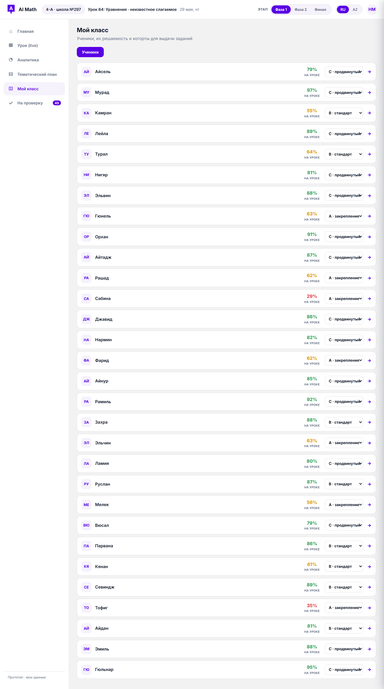

---

## 12. Карточка ученика

**User stories.**
- TS-46. Как учитель, я хочу за минуту собрать **картину по конкретному ребёнку**, чтобы ответить родителю или решить, как с ним работать.
- TS-47. Как учитель, я хочу видеть **решаемость по урокам** (доля верных на каждом пройденном уроке), чтобы видеть динамику.
- TS-48. Как учитель, я хочу видеть **статистику домашних заданий** (средняя решаемость ДЗ и сколько сдано в срок), чтобы понимать домашнюю работу ребёнка.
- TS-54. Как учитель, я хочу видеть **навыки и их критерии по темам** (по пройденным темам — навык + его критерии с %), чтобы понимать, что конкретно у ребёнка просело.

**Контент и действия.**
- Шапка: имя, средние **% на уроках** и **% дома** (TS-46).
- **Решаемость по урокам** — доля верно решённых заданий на каждом пройденном уроке (линейные бары) (TS-47).
- **Навыки и критерии по темам** (TS-54): по пройденным темам — навык (с общим %) и под ним **его критерии** с % (бары).
- **Домашние задания** — средняя решаемость ДЗ и сколько сдано в срок (TS-48).

*В Фазе 1 карточка устроена по темам: решаемость по урокам + навыки/критерии + статистика ДЗ. Разбор ошибок по шагам, история формативной ОС и рекомендованная когорта — следующие фазы.*

**Референс.** 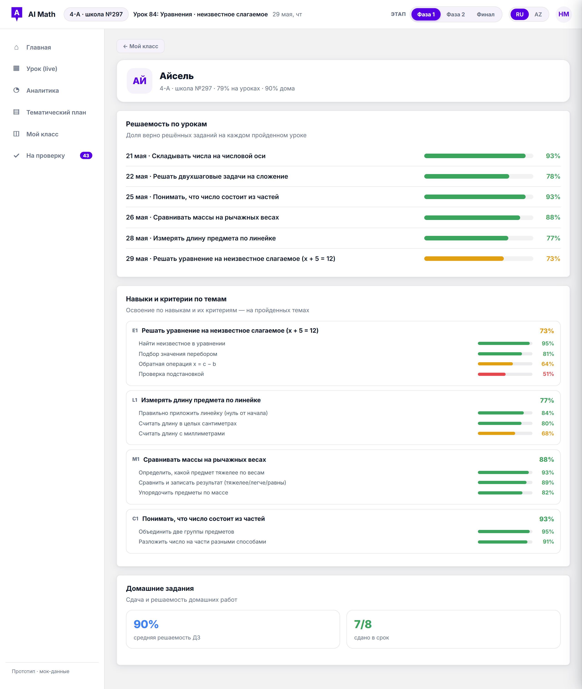
